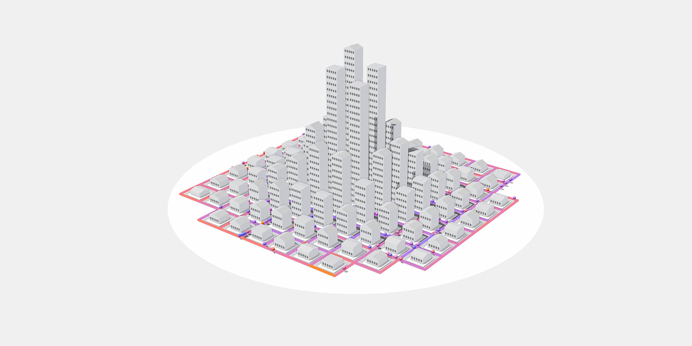

<br>

# Cities Morphology

This repository contains two packages for generating city layouts based on high-level parameters, the source code for an interactive visualization that explores different city layouts and their effect on travel distance, and the code to reproduce our experiments on the impact of travel distance on city shapes. 


In case you use any of the code in this repository in any way, including screenshots of the visualization, please cite: 

```tex
TODO
```

and link to [https://vis.csh.ac.at/cities-morphology](https://vis.csh.ac.at/cities-morphology) . 

This code was created by [Tobias Batik](	http://tobiasbatik.at), and the primary purpose of this repository is to reproduce the results outlined in the publication above. If you have any questions regarding the code, feel free to contact me: contact@tobiasbatik.at.  

<br>

## Content

- The **city-grid** package in `/city-grid` provides functionality to construct a new city network and to create agent simulations to simulate random travel paths inside the network.  Works in Node and the browser. 
-  **city-grid-webworker** in `/city-grid-webworker` provides functionality for creating simulations asynchronously in a web worker. The package should only work for the browser.

+ The folder `/travel-distance-experiments` folder contains the node programs to reproduce our experiments on city shapes and travel distance.
+ The web application **Cities Morphology, located at/cities-morphology, is an interactive visualization that explores different city design paradigms. The application allows users to modify city parameters and displays the resulting city as a three-dimensional model. The visualization can also be accessed under [vis.csh.ac.at/cities-morphology](https://vis.csh.ac.at/cities-morphology) .

<br>

## Usage

To run the cities morphology or the travel distance experiments, you have to build the city-grid and city-grid-concurrent packages first. Run:

```
cd city-grid
npm i
npm run build
```


```
cd city-grid-webworker
npm i
npm run build
```

<br>

### city-grid

Module to create city grids based on high-level city parameters and agent simulations using shortest paths. The code should work in both the browser and Node.js.

To create a city from parameters, and a corresponding path sim: 

```typescript
import {ellipticalGridFromCityParameters, randomPathSimulation} from 'city-grid'

const city = ellipticalGridFromCityParameters(2000, 20, 8, 10, 7, 1.5, 3) // to create the city
const pathSim = randomPathSimulation( // to create a path sim 
  city.streetGraph, 
  city.cityParameters.residents * 2, 
  getNodeWeights(city)
)
```

<br>

### city-grid-webworker

Utility to compute a Citygrid path simulation in a web worker. The code is intended to be used in a browser and probably will not work in Node.

To compute the results of a path simulation for one parameter altered 

```typescript
import { ellipticalGridFromCityParameters } from 'city-grid'
import { computePathSimulationVariationsWorker } from 'city-grid-webworker'

const city = ellipticalGridFromCityParameters(2000, 20, 8, 10, 7, 1.5, 3) // base city
const valueToBeAltered: keyof CityParameters = 'sprawl'
const values = [1, 1.5, 2, 2.5, 3]
const numValInfo = { value: 1.0, type: 'share' }
const manDist = true


computePathSimulationVariationsWorker(city.cityParameters, 'sprawl', values, numValInfo,manDist)
  .then((results) => {
      console.log('variations', results, valueToBeAltered)
  })
```

<br>


### cities-morphology

To build the code, run the commands below and copy the content of the ./dist folder to your web server. The project is intended to be served from a folder with a URL like https://.../cities-morphology/. If another suburl than cities-morphology is used, adapt the `base` parameter in the `vite.config.ts` file. 

```bash
cd cities-morphology
npm i
npm run build
```

To run a development server: 

```bash
npm run dev
```

The main 3D visualization can be found in `modules/city-render`. Creating a three-dimensional city using three.js. When run as a development server, a frame-rate view, a button to download the Three.js canvas, and high-resolution shadows are added. Behavior can be adapted in `vite.config.js` by setting ` __DEBUG_INFO__` and `__HIGH_RES_SHADOWS__`.

<br>


### travel-distance-experiments

Code to recreate variation experiment; Changing every parameter 100 times with parameters approximating Vienna as a base.

``` bash
cd travel-distance-experiments
npm run i
npm run variations # to run the variation experiment
npm run vienna # to get and output base paramters of the city of Vienna
npm run distance #to compute the average travel distance and 
                 #total distance for user defined parameter.
```

After completing the variation experiment, the results are saved to the /out folder as .csv and .json files. 
